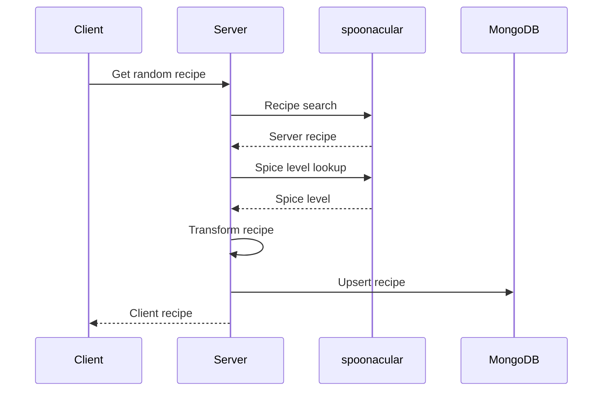
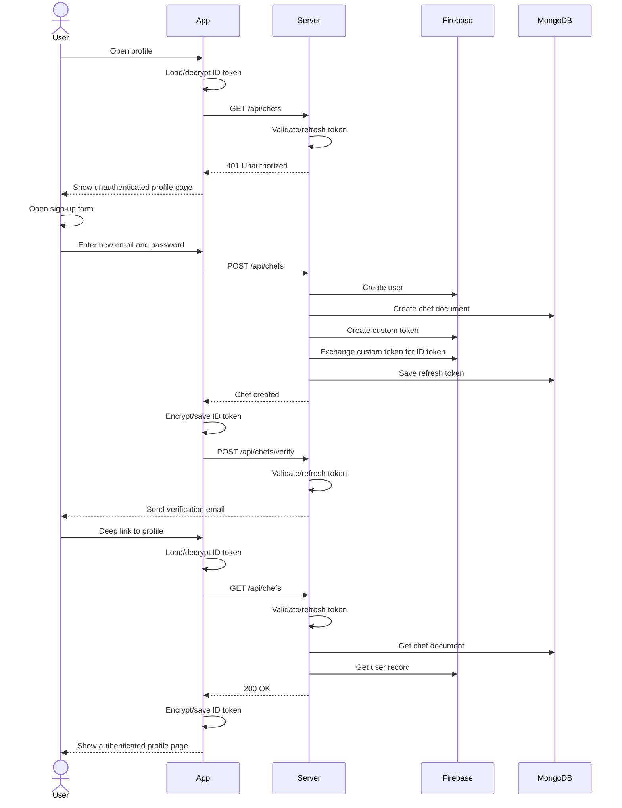
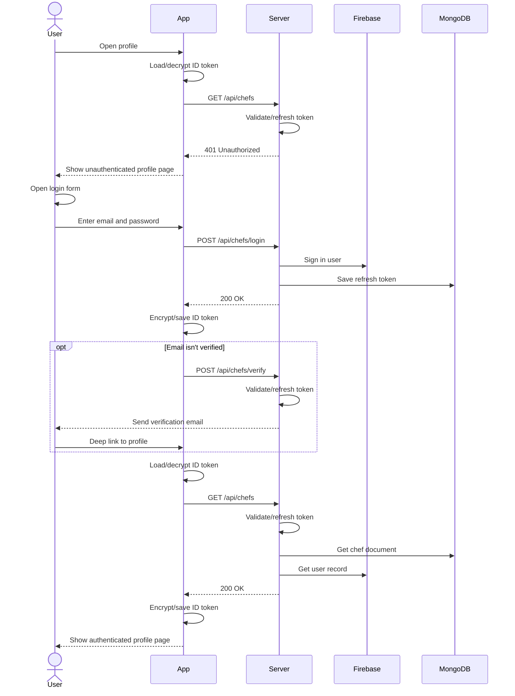
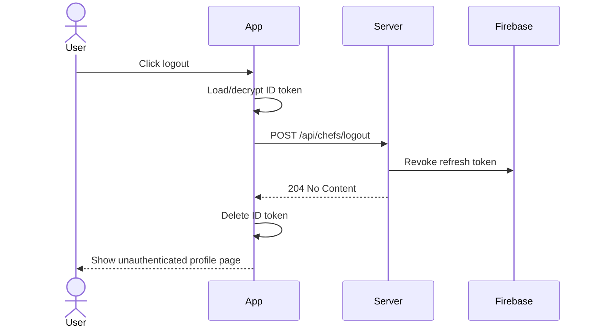
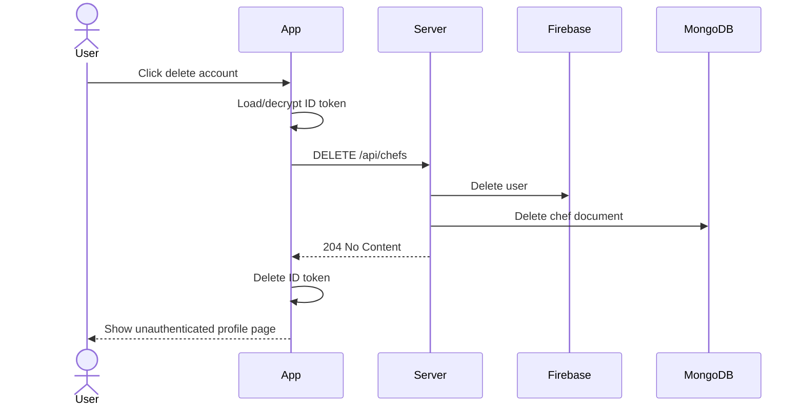
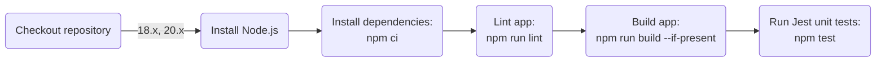
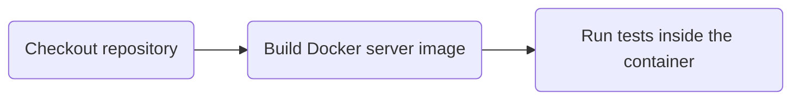
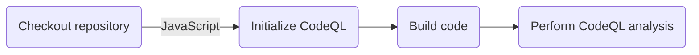
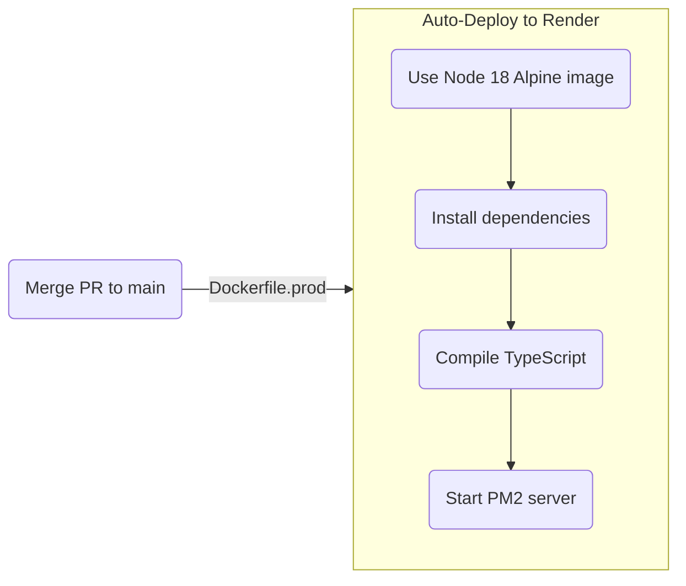

# EZ Recipes Server

[](https://github.com/Abhiek187/ez-recipes-server/actions/workflows/node.js.yml)
[](https://github.com/Abhiek187/ez-recipes-server/actions/workflows/codeql.yml)


## Overview

This is an API built using Express to fetch low-effort recipes from [spoonacular](https://spoonacular.com/food-api). These are recipes that can be made within an hour, use common kitchen ingredients, and can produce multiple servings. It's ideal for new chefs learning how to cook, or people with little free time who want to cook something tasty. This API is connected to the [web](https://github.com/Abhiek187/ez-recipes-web), [iOS](https://github.com/Abhiek187/ez-recipes-ios), and [Android](https://github.com/Abhiek187/ez-recipes-android) apps so anyone can view the recipes on any device.

In addition to spoonacular, MongoDB is used to cache the recipes for improved query performance. It is also used to perform full-text search on recipes based on various criteria like recipe name, description, or ingredients.

Firebase is used to manage user authentication. Chefs can create an account to get access to additional features, including:

- Rating recipes
- Favoriting recipes
- Accessing recently viewed recipes

By delegating Firebase to the server-side, these settings can be synced across all the client apps for a seamless cooking experience.

## Features

- TypeScript for added type safety
- RESTful APIs
- MongoDB to store data, query data, and do full-text search
- Pagination to reduce bandwidth and optimize query performance
- Firebase for user authentication
- Docker to containerize the server on any machine
- OpenAPI to publish standardized API documentation
- GitHub Actions for automated testing and deployment in a CI/CD pipeline
- Mermaid to write diagrams as code

## Architecture Diagram


## Sequence Diagrams

### Fetch Random Recipe

Below is a sequence diagram when the client asks the server to fetch a random recipe:



### Create Account

Below shows how the client & server interact with Firebase & MongoDB to handle authentication:



### Login



### Logout



### Delete Account



## Pipeline Diagrams

### NPM CI



### Docker CI



### CodeQL



### Deployment



## Documentation

Visit [Swagger UI](https://ez-recipes-server.onrender.com/) to view the OpenAPI docs for this API.

## Installing Locally

1. [Clone](https://github.com/Abhiek187/ez-recipes-web.git) this repo.
2. Create an account at [https://spoonacular.com/food-api](https://spoonacular.com/food-api) to obtain an API key. Then create a file called `.env` with the following content:

```
API_KEY=YOUR_API_KEY
```

3. Create a database in [MongoDB Atlas](https://www.mongodb.com/atlas) and copy the URI in `.env`:

```
MONGO_URI=YOUR_MONGODB_URI
```

4. Create a [Firebase Project](https://console.firebase.google.com) with the following:
   - A private key under Service Accounts
   - A web API key

Save both of these outside this repo and reference them in `.env`:

```
GOOGLE_APPLICATION_CREDENTIALS=PATH_TO_PRIVATE_KEY
WEB_API_KEY=YOUR_WEB_API_KEY
```

5. Generate a SECRET_KEY for encryption and save it in `.env`:

```bash
openssl rand -base64 64 # YOUR_SECRET_KEY
SECRET_KEY=YOUR_SECRET_KEY
```

6. Run `npm install` to install all the dependencies.

**Dev:** Run `npm start`.

**Prod:** Run `npm run build` to generate a build in the `dist` directory. Then run `npm run server` to start the server using [pm2](https://pm2.io/).

The server will be listening on `http://localhost:5000`. To stop the server, press `CTRL-C`.

## Installing with Docker

1. Follow the above installation steps.
2. Run `docker compose -f docker-compose.yml -f docker-compose-[dev|prod].yml up -d` to start up both the web and server containers in dev or prod.

To stop the containers, run `docker compose down`.

## Testing

Run `npm test` to run the unit tests using Jest.

## Related Repos

- [Web app](https://github.com/Abhiek187/ez-recipes-web)
- [iOS app](https://github.com/Abhiek187/ez-recipes-ios)
- [Android app](https://github.com/Abhiek187/ez-recipes-android)
