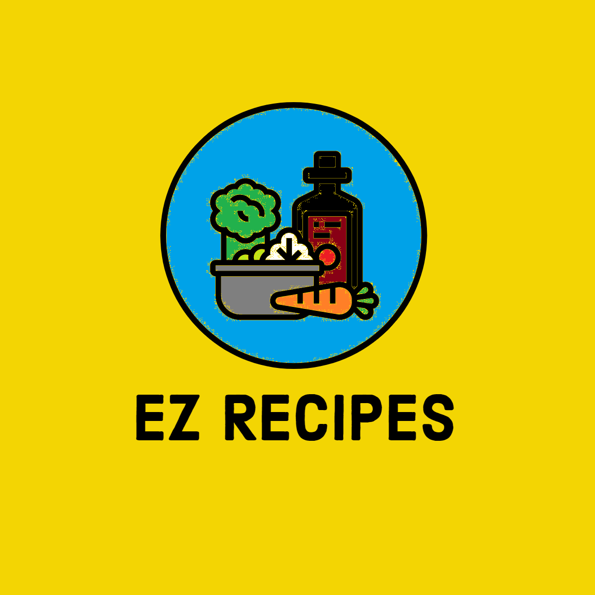
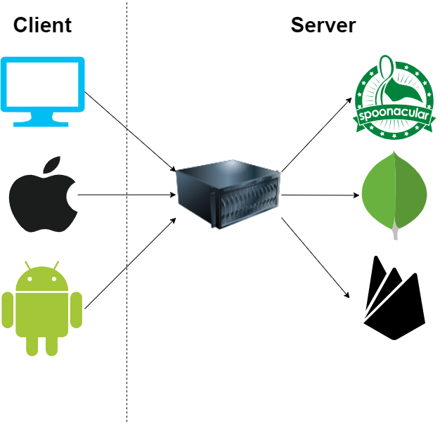
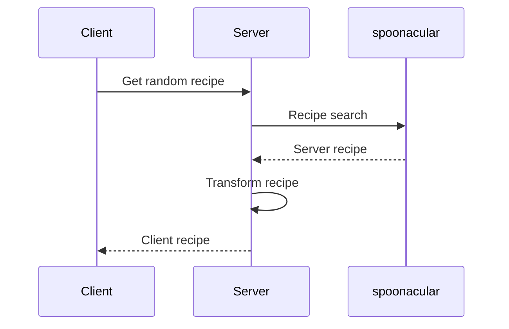
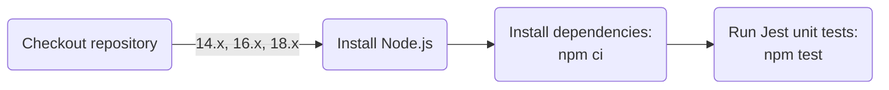
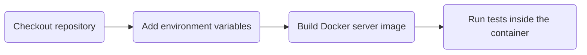
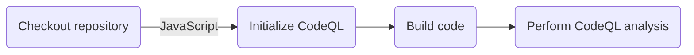
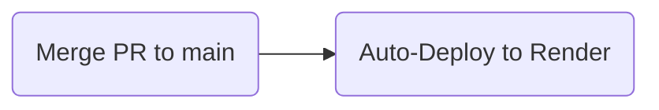

# EZ Recipes Server

[](https://github.com/Abhiek187/ez-recipes-server/actions/workflows/node.js.yml)
[](https://github.com/Abhiek187/ez-recipes-server/actions/workflows/codeql.yml)



## Overview

This is an API built using Express to fetch low-effort recipes from [spoonacular](https://spoonacular.com/food-api). These are recipes that can be made within an hour, use common kitchen ingredients, and can produce multiple servings. It's ideal for new chefs learning how to cook, or people with little free time who want to cook something tasty. This API is connected to the [web](https://github.com/Abhiek187/ez-recipes-web), [iOS](https://github.com/Abhiek187/ez-recipes-ios), and [Android](https://github.com/Abhiek187/ez-recipes-android) apps so anyone can view the recipes on any device.

### Architecture Diagram



### Sequence Diagram

Below is a sequence diagram when the client asks the server to fetch a random recipe:



## Features

- TypeScript for added type safety
- RESTful APIs
- Docker to containerize the server on any machine
- OpenAPI to publish standardized API documentation
- GitHub Actions for automated testing and deployment in a CI/CD pipeline
- Mermaid to write diagrams as code

## Pipeline Diagrams

### NPM CI



### Docker CI



### CodeQL



### Deployment



## Documentation

Visit [SwaggerHub](https://app.swaggerhub.com/apis-docs/Abhiek187/ez-recipes/1.0.0) to view the OpenAPI docs for this API.

## Installing Locally

1. [Clone](https://github.com/Abhiek187/ez-recipes-web.git) this repo.
2. Create an account at [https://spoonacular.com/food-api](https://spoonacular.com/food-api) to obtain an API key. Then create a file called `.env` with the following content:

```
API_KEY=YOUR_API_KEY
```

3. Run `npm install` to install all the dependencies.

**Dev:** Run `npm start`.

**Prod:** Run `npm run build` to generate a build in the `dist` directory. Then run `npm run server` to start the server using [pm2](https://pm2.io/).

The server will be listening on `http://localhost:5000`. To stop the server, press `CTRL-C`.

## Installing with Docker

1. Follow steps 1-2 above.
2. Run `docker-compose -f docker-compose.yml -f docker-compose-[dev|prod].yml up -d` to start up both the web and server containers in dev or prod.

To stop the containers, run `docker-compose down`.

## Testing

Run `npm test` to run the unit tests using Jest.
